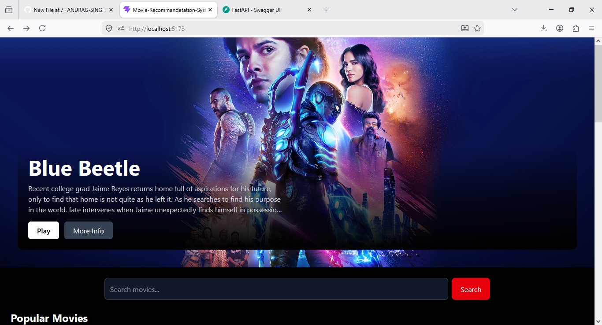

# 🎬 Movie Recommendation System

A full-stack **Movie Recommendation System** developed using **Machine Learning**, **React.js**, and **FastAPI**. The application recommends similar movies based on user input using a content-based filtering approach with TF-IDF vectorization and similarity calculations.

The project provides a clean and interactive UI for users to search and receive personalized movie recommendations instantly.

---

## 🚀 Features

✔ Movie recommendation using Machine Learning  
✔ Content-based recommendation system  
✔ Similar movie suggestions  
✔ Responsive React frontend  
✔ FastAPI backend for handling requests  
✔ Interactive and user-friendly interface  
✔ Real-time prediction and recommendation generation  
✔ Full-stack integration

---

## 🛠️ Tech Stack

### Frontend
- React.js
- Vite
- HTML
- CSS
- JavaScript

### Backend
- Python
- FastAPI

### Machine Learning
- Scikit-learn
- Pandas
- NumPy
- TF-IDF Vectorizer

### Tools
- Git
- GitHub
- VS Code

---

## 📂 Project Structure

```bash
MOVIE-RECOMMEND-SYSTEM/
│
├── Backend/
│   │
│   ├── __pycache__/
│   ├── venv/
│   ├── .gitignore
│   ├── df.pkl
│   ├── indices.pkl
│   ├── main.py
│   ├── requirements.txt
│   ├── tfidf.pkl
│   └── tfidf_matrix.pkl
│
├── Frontend/
│   │
│   ├── node_modules/
│   ├── public/
│   ├── src/
│   ├── .gitignore
│   ├── eslint.config.js
│   ├── index.html
│   ├── package-lock.json
│   ├── package.json
│   ├── README.md
│   └── vite.config.js
│
└── README.md
```

---

## ⚙️ Installation and Setup

### Clone Repository

```bash
git clone https://github.com/yourusername/Movie-Recommend-System.git
```

### Backend Setup

```bash
cd Backend

pip install -r requirements.txt

uvicorn main:app --reload
```

### Frontend Setup

```bash
cd Frontend

npm install

npm run dev
```

---

## 📸 Project Screenshots

Add your screenshots here:




---

## 🔍 How It Works

1. User enters a movie name.
2. The ML model processes movie information using TF-IDF vectorization.
3. Similarity scores are calculated.
4. The system identifies similar movies.
5. Recommended movies are displayed on the frontend.

---

## 🔮 Future Improvements

- User authentication
- Hybrid recommendation system
- Movie ratings and reviews
- Watchlist functionality
- Movie trailer integration
- Cloud deployment

---

## 🤝 Contributing

Contributions are welcome. Feel free to fork this repository and submit a pull request.

---

## 📜 License

This project is available under the MIT License.
